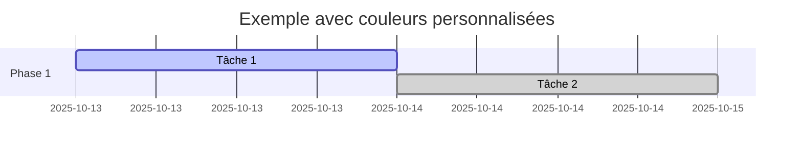
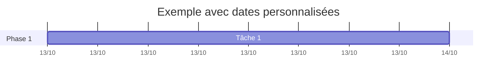
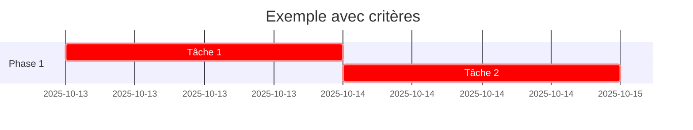

# Guide d'Utilisation des Diagrammes de Gantt

## Vue d'ensemble

Les diagrammes de Gantt des spécifications techniques de baobab-cursor-cli sont disponibles en plusieurs formats pour faciliter leur utilisation et leur intégration dans différents outils.

## Formats Disponibles

### 1. Fichiers Mermaid (`.mermaid`)
- **Usage** : Code source pour génération d'images
- **Avantages** : Version contrôlée, modifiable, lisible
- **Outils** : Mermaid Live Editor, GitHub, VS Code

### 2. Fichiers JSON (`.json`)
- **Usage** : Données structurées pour traitement programmatique
- **Avantages** : Parsable, intégrable dans des outils de gestion de projet
- **Outils** : Scripts personnalisés, outils de reporting

### 3. Images PNG (`.png`)
- **Usage** : Représentations visuelles pour documentation
- **Avantages** : Universel, intégrable dans tout document
- **Outils** : Documentation, présentations, rapports

## Génération des Images

### Prérequis

```bash
# Installation de Node.js et npm
# Puis installation de Mermaid CLI
npm install -g @mermaid-js/mermaid-cli
```

### Scripts de Génération

#### Linux/macOS
```bash
./scripts/generate_gantt_images.sh
```

#### Windows PowerShell
```powershell
.\scripts\generate_gantt_images.ps1
```

#### Génération Manuelle

```bash
# Pour une phase spécifique
mmdc -i docs/specifications/phase_001/gantt/gantt.mermaid -o docs/specifications/phase_001/gantt/gantt.png

# Pour le diagramme global
mmdc -i docs/specifications/global_gantt.mermaid -o docs/specifications/global_gantt.png
```

## Visualisation des Diagrammes

### 1. Mermaid Live Editor
- URL : https://mermaid.live/
- Copier-coller le contenu des fichiers `.mermaid`
- Génération d'images en temps réel

### 2. GitHub
- Les fichiers `.mermaid` sont automatiquement rendus
- Visualisation directe dans l'interface GitHub
- Pas besoin de génération d'images

### 3. VS Code
- Extension "Mermaid Preview" recommandée
- Visualisation en temps réel
- Export vers différents formats

### 4. Outils de Documentation
- **GitBook** : Support natif des diagrammes Mermaid
- **Docusaurus** : Plugin Mermaid disponible
- **MkDocs** : Extension Mermaid disponible

## Intégration dans la Documentation

### Markdown
```markdown

```

### HTML
```html

```

### LaTeX
```latex
\includegraphics[width=\textwidth]{phase_001/gantt/gantt.png}
```

## Personnalisation des Diagrammes

### Modification des Couleurs


### Modification des Dates


### Ajout de Critères


## Maintenance des Diagrammes

### Mise à Jour des Dates
1. Modifier les fichiers `.mermaid`
2. Régénérer les images PNG
3. Mettre à jour la documentation

### Ajout de Nouvelles Tâches
1. Ajouter dans le fichier `.mermaid`
2. Mettre à jour le fichier `.json` correspondant
3. Régénérer les images

### Synchronisation des Formats
- Les fichiers `.mermaid` sont la source de vérité
- Les fichiers `.json` sont générés à partir des `.mermaid`
- Les images `.png` sont générées à partir des `.mermaid`

## Bonnes Pratiques

### 1. Cohérence
- Utiliser les mêmes conventions de nommage
- Maintenir la cohérence des couleurs
- Respecter le format de dates

### 2. Lisibilité
- Limiter le nombre de tâches par diagramme
- Utiliser des noms de tâches explicites
- Grouper les tâches logiquement

### 3. Maintenance
- Documenter les modifications
- Versionner les changements
- Tester la génération des images

## Dépannage

### Problèmes Courants

#### Mermaid CLI non trouvé
```bash
# Vérifier l'installation
which mmdc
# Réinstaller si nécessaire
npm install -g @mermaid-js/mermaid-cli
```

#### Erreurs de syntaxe Mermaid
- Vérifier la syntaxe sur https://mermaid.live/
- Valider les dates et formats
- Vérifier les caractères spéciaux

#### Images non générées
- Vérifier les permissions d'écriture
- Vérifier l'existence des dossiers de destination
- Vérifier les chemins des fichiers

### Support
- Documentation Mermaid : https://mermaid-js.github.io/mermaid/
- Issues GitHub : https://github.com/mermaid-js/mermaid/issues
- Communauté : https://github.com/mermaid-js/mermaid/discussions
